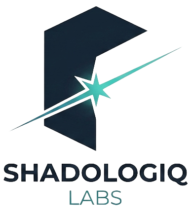

[✦ ShadoLogiq Labs](https://shadologiq.com) · [Gapps Embed](https://gapps-embed.shadologiq.com/) · **README** · [Source](https://github.com/shadologiq-labs/gapps-embed)

---

> 👉 **Looking for docs, demo, or install instructions?** Visit **[gapps-embed.shadologiq.com](https://gapps-embed.shadologiq.com/)** — the polished page with a live themed demo, interactive builder, and a 3-step install guide.
>
> This README is for contributors and self-hosters. If you just want to *use* Gapps Embed, the link above is the friendlier path.

<div align="center">

<picture>
  <source media="(prefers-color-scheme: dark)" srcset="assets/sll.png">
  
</picture>

# Gapps Embed

**Embed Google apps anywhere. One iframe. No build step. No tracking.**

[Live demo](https://gapps-embed.shadologiq.com/) · [Quick start](#quick-start) · [Configuration](#configuration-via-query-string)

</div>

---

A lightweight toolkit for dropping a Google apps grid onto any site — your intranet, a portal, a sidebar, a launcher. Three visual presentations share one data core, one sprite, and zero build dependencies. Theme it via query string or `postMessage`. Rewrite URLs for any Workspace domain.

Static HTML + JavaScript. No accounts. No analytics. No server-side anything.

## Presentations

| | | |
|---|---|---|
| **Launcher** | Plain icon grid, identical to Google's own app launcher | ✅ `v1.0.0` |
| **Spotlight** | Card grid with name, description, and "Learn more" link | 🛠 `v1.1` |
| **Menu** | Waffle button that opens a Google-style popover panel | 🛠 `v1.2` |

## Quick start

```html
<iframe src="https://gapps-embed.shadologiq.com/gapps-launcher.html"
        style="border: none; width: 100%; height: 600px;"></iframe>
```

That's it. You now have a Google apps grid on your page.

## Configuration via query string

All presentations honor the same parameters.

### Filter — pick which apps to show

| Param | Example | Effect |
|---|---|---|
| `apps` | `?apps=mail,drive,docs` | Show specific apps in that order |
| `category` | `?category=communication` | Show apps in one or more categories |
| `filter` | `?filter=workspace` | Show only `workspace`-tagged apps |

### Auth — point at your Workspace

| Param | Example | Effect |
|---|---|---|
| `domain` | `?domain=example.com` | Rewrite URLs through `accounts.google.com/AccountChooser` for your Workspace domain |
| `custom` | `?custom=mail,calendar` | Use `https://app.domain/` for these apps instead of the default Google URL |

### Theme — match your site

| Param | Example | Effect |
|---|---|---|
| `tile` | `?tile=%23ffffff` | Tile background color |
| `text` | `?text=%23202124` | Label text color |
| `texthover` | `?texthover=%230E1B2A` | Label text color *on hover* — set when your hover background contrasts with the rest state (e.g., a "spark flip" theme that ignites the tile) |
| `hover` | `?hover=%23f1f3f4` | Hover state background |

Colors are URL-encoded hex (e.g., `#1FA9A5` → `%231FA9A5`). `hover` is auto-derived from `tile` if you don't set it. `texthover` defaults to `text` if omitted (the label stays the same color on hover).

## Theming via postMessage

Update the theme dynamically from the parent page:

```js
iframe.contentWindow.postMessage({
  type: 'gapps-embed-theme',
  tileBg:         '#ffffff',
  hoverBg:        '#f1f3f4',
  textColor:      '#202124',
  textColorHover: '#202124'  // optional — defaults to textColor if omitted
}, '*');
```

Use `textColorHover` when the hover background contrasts strongly with the rest tile and the label needs to flip color to stay readable (e.g., dark label at rest on a muted tile, light label on hover when the tile lights up — or the reverse "spark flip" pattern).

The iframe reports its rendered height back so you can size it correctly:

```js
window.addEventListener('message', e => {
  if (e.data.type === 'gapps-embed-height') {
    iframe.style.height = e.data.height + 'px';
  }
});
```

## Pinning to a version

Production deployments should pin to a tagged release rather than tracking `main`. Use [raw.githack.com](https://raw.githack.com):

```html
<iframe src="https://rawcdn.githack.com/shadologiq-labs/gapps-embed/v1.0.0/gapps-launcher.html">
```

## Self-hosting

You don't need our GitHub Pages deployment. Clone the repo, edit `src/apps.js` to add/remove/relabel apps, and serve the files from any static host:

```bash
git clone https://github.com/shadologiq-labs/gapps-embed.git
cd gapps-embed
# edit src/apps.js if you want a custom app list
python -m http.server 8080
```

That's the entire setup. Open `http://localhost:8080/gapps-launcher.html`.

## What's in the box

```
gapps-embed/
├── index.html                # Landing page
├── gapps-launcher.html       # Presentation 1: plain icon grid
├── gapps-builder.html        # Interactive embed-URL builder
├── src/
│   ├── apps.js               # Shared app inventory (the data core)
│   ├── filter.js             # Shared filter pipeline (querystring → apps)
│   ├── theme.js              # Shared theme + postMessage handling
│   └── sprite.css            # Icon sprite coordinates
└── assets/
    ├── sprite.png            # All app icons in one sprite
    ├── favicon-*.png         # Page favicons
    └── sll_*.png             # ShadoLogiq Labs brand marks
```

## Why this exists

Google's app launcher is a closed UI element you can't embed outside `google.com`. Workspace admins, intranet builders, and anyone running a portal end up either rebuilding it from scratch or accepting that their users have to leave the site to find Gmail.

Gapps Embed is the small, free, open-source version of that launcher. It runs entirely in the visitor's browser, makes no network calls beyond loading the static files, and has no tracking. Drop it in and forget about it.

## Stack

- Vanilla JavaScript (ES2022+, no transpilation)
- Zero runtime dependencies
- Static HTML/CSS, served as-is by GitHub Pages
- One PNG sprite for all 50 app icons (refreshed via `REFRESHING_ICONS.md`)

## Contributing

See the org [Contributing guide](https://github.com/shadologiq-labs/.github/blob/main/CONTRIBUTING.md). Project-specific notes:

- **No build step.** Don't add one. Files must be drop-in usable.
- **Test all three breakpoints:** ≥1024px / 600–1023px / <600px.
- **Sprite refreshes** must update both `assets/sprite.png` and the `.icon-*` CSS coords in `src/sprite.css` in lockstep.

## License

MIT — see [LICENSE](LICENSE).

---

<div align="center">


A [ShadoLogiq Labs](https://shadologiq.com) project — free, libre, and local.

</div>

---

[✦ ShadoLogiq Labs](https://shadologiq.com) · [Gapps Embed](https://gapps-embed.shadologiq.com/) · **README** · [Source](https://github.com/shadologiq-labs/gapps-embed)
